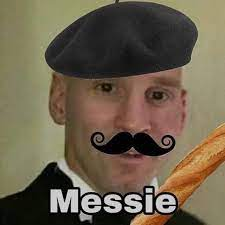

# Presentación de Programación con Objetos I de Luciano Garegnani
-  Estudio en la Universidad Nacional de Hurlingham- [UNAHUR](https://unahur.edu.ar)
-  Vivo en Hurlingam.
-  Mi carrera es Tecnicatura en Programación
-  Tengo 20 años.

## Mis gustos.
- Toco la guitarra.
- Juego tenis en el taller de deportes de la UNAHUR.
- De vez en cuando juego algunos juegos.
- Me dedico a hacer codigos que no suelen funcionar.

## También me gustan los memes.

